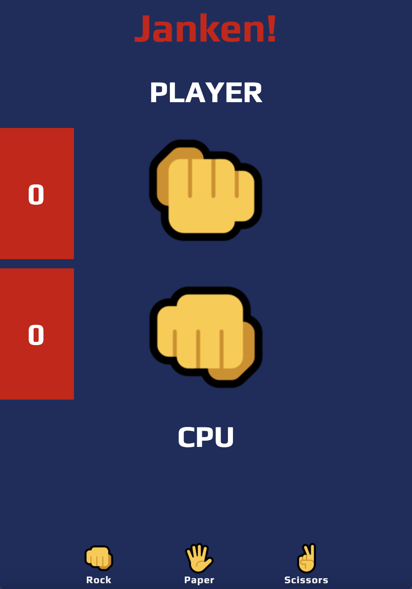

# Rock-Paper-Scissors 
## Author - Abdul Oketunde

## Overview 
This game was made during the 4th week of my _nology course. 
I used HTML CSS3 and vanilla Javascript. 

[Check the Live Demo!](https://ab-96.github.io/Rock-Paper-Scissors/)



## My Design
This game was designed in Figma first. Then in VS Code, I used a CSS grid to dynamically position all the elements on the page. The elements are responsively positioned while in mobile view. 

## How it works
The user has three options: rock, paper and scissors. The person that plays the strongest “object” is the winner of the game. As soon as the user makes their choice, the computer will make its choice too. The program will then determine who won the round. The game will end when either the user or the computer's score reaches 3. 

## The code 
I started by creating global variables to store information about the player and computer scores and choices.

```javascript 
let playerChoise  = ""; let computerChoise = "";
let playerScore = document.querySelector(".player-score");
let computerScore = document.querySelector(".cpu-score");
```

The player choice button all have a click event listener attached to them. 

```javascript 
selectChoice.forEach(choice => {
    choice.addEventListener("click", () => {

        const audio = new Audio('assets/sounds/mixkit-arcade-game-jump-coin-216 (1).wav');
        audio.play();
        playerChoise = choice.innerText;
        getComputerChoice()
        setTimeout(displayCpuSelection, 1500)
        setTimeout(displaySelection, 1000);
        setTimeout(incrementScore, 1500)
        displayWinner()
    })

```
As soon as the user makes their choice, it will store the player's choice in the `playerChoise` variable, play a sound and run several helper functions. These functions are: 

`getComputerChoice()` : This gets the computer's choise by using `Math.random()`. 
`setTimeout(displayCpuSelection, 1500)` : This function displays the computer's selection i.e if "Paper" is selected, it will change the img on screen accordingly. 
`setTimeout(displaySelection, 1000);`: This function displays the user's selection i.e if "Paper" is selected, it will change the image on screen accordingly. 
`setTimeout(incrementScore, 1500)`: This function is responsible for incrementing the score if a greater object is selected over the opponent.
`displayWinner()`: This function displays the winner of the game and also runs the `restart` function. 

# Future Implementations 
For future implementations, a two-player option and an option to choose the number of rounds to play. Additionally, applying animations to the hands before a choice is made will help improve the game.